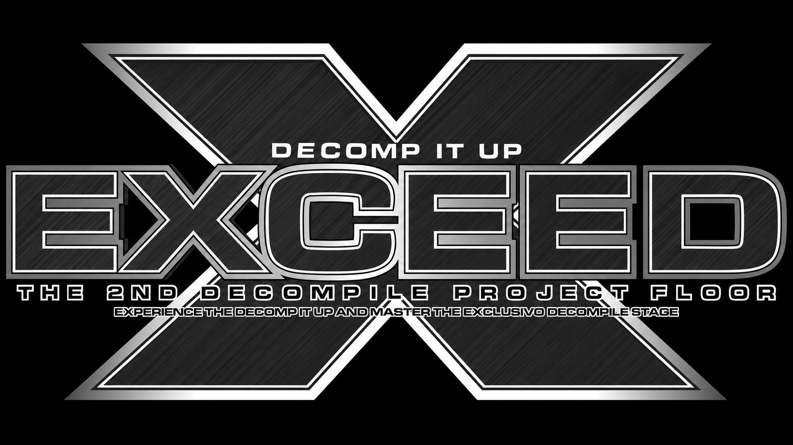

# ExceedReconstructed

A faithful C reconstruction of **Pump It Up: Exceed**, the PC build of the arcade executable (`exceed.exe`).

This project reverse-engineers the original x86 binary and reproduces its gameplay, rendering, audio, and state machine as closely as possible — no emulation, no wrappers. Native executable for Windows and Linux, built with SDL2 + OpenGL.

It started as **PumpyReconstructed** (a reconstruction of `PUMPY.EXE`, Pump It Up: PREX 3). The PREX 3 screens are still in the tree but disabled (`#if 0`); the gameplay core is shared and was adapted to the Exceed rules.

## Status

| Feature                                                   | Status |
| --------------------------------------------------------- | ------ |
| Attract loop (WARN → LOGO → INTRO → HIGHSCORE → demo)      | ✅      |
| Demo play (autoplay on both sides, 35 s)                   | ✅      |
| Title / credit / late join                                 | ✅      |
| Song select (CSelect): 3 channels, 3D banner wheel, panel  | ✅      |
| Song select: 60 s counter, sounds, command codes           | ✅      |
| Hidden songs unlock (`SHOWHIDDEN`)                         | ✅      |
| Gameplay: Normal / Hard / Crazy / Freestyle / Nightmare    | ✅      |
| BATTLE mode (max combo comparison, WIN/LOSE grade)         | ✅      |
| **X-MODE** (`EXCEED` flag)                                 | ✅      |
| HalfDouble                                                 | ⚙️ Working, disabled by default (as in the original) |
| Division                                                   | ⚙️ Working, disabled by default (as in the original) |
| Scoring + grade (Exceed formula)                           | ✅      |
| Stage flow (NEXTSTAGE / STAGEBREAK / extra stage / GAMEOVER) | ✅    |
| MOV2 video playback (`BGA\*.MOV`)                          | ✅      |
| RESPACK / ENC2 resources, BGA/BGA2 playback                | ✅      |
| BGM/SFX audio (SDL2, WAVs read from disk)                  | ✅      |
| HIGHSCORE screen (EEPROM ranking, 20 entries)              | ✅      |
| NAMEINPUT / Internet Ranking (IR)                          | ✅      |
| Service menu (SETUP / BOOKKEEPING) + credits               | ✅      |
| Debug console (original commands, `/set` camera vars)      | ✅      |
| Alt+Enter fullscreen toggle                                | ✅      |

HalfDouble and Division are implemented in the gameplay code but, like in the original
executable, they are not reachable from the normal UI (the original console even answers
`-hd` with *"Half-double mode is not implemented."*). They will be exposed in a future version.

## Modifiers (Commands)

Entered on the song select screen with the pads of the player they apply to. Each one
maps to a bit of the player's modifier mask (`+0x184`), as in the original.

| Command | Sequence | Effect |
| ------- | -------- | ------ |
| Speed | `UL UR UL UR C` | Cycles x1 → x2 → x3 → x4 → x8 → RV → x1 |
| Random Velocity (RV) | `UL UR UL UR UL UR UL UR C` | Toggles RV (`RACCEL`), clears fixed speeds |
| Vanish / Non-Step | `UL UR DL DR C` | Cycles V → NS → V+NS → off |
| Mirror | `DR DL UR UL DR DL UR UL C` | Toggles M |
| Random | `UL UR UL UR DL DR DL DR C` | Toggles R |
| Freedom | `UL DL UR DR DR UL UR DL C` | Hides the step zone (receptors) |
| Earthworm | `DR DL UR UL DR UR DL UL C` | Variable speed (x1/x2/x3 cycles), clears fixed speeds |
| X-MODE | `DL UR DL UR DR UL DR UL C` | Global toggle: arrows drift sideways as they scroll |
| Show hidden | `UR UR DL UL DR UR UL UR UR` | Unlocks the hidden songs |
| Reset | `DL DR` × 3 | Clears all of the player's modifiers |

## Project Structure

```
ExceedReconstructed/
├── src/
│   ├── main.c          # Entry point, state machine, game loop
│   ├── warning.c / logo.c / intro.c   # Attract screens
│   ├── exceed_select.c # Song select (CSelect)
│   ├── exceed_songs.c  # Song table generated from exceed.exe
│   ├── gameplay.c      # Input, judgment, holds, rendering, BATTLE, X-MODE
│   ├── result.c        # Grade screen and stage progression
│   ├── highscore.c     # HIGHSCORE screen
│   ├── nameinput.c / ir.c / ir_password.c / ir_mixtable.c   # Name input / Internet Ranking
│   ├── movie.c         # MOV2 video decoder
│   ├── resource.c / df_resource.c     # SPR/SP2/BGA/DAT/RESPACK loading
│   ├── bga.c / bga2_parser.c / vsl.c  # BGA playback, 3D VSL meshes
│   ├── audio.c         # SDL2 BGM/SFX
│   ├── eeprom.c / service_menu.c / coin.c / ranking.c
│   ├── debug_console.c # In-game console
│   ├── render.c / texture.c / util.c / font.c / window.c / input.c
│   └── song_select.c, menu.c, staff.c, game_option.c   # PREX 3 screens (disabled)
├── include/            # Headers (pumpy.h = main game state)
├── tools/              # Standalone helpers (extractors, dumpers, generators)
├── docs/               # PARIDADE.md, GAMEPLAY_RENDER.md
└── CMakeLists.txt
```

## Building (Windows and Linux)

The same source builds on both: window, input and audio use **SDL2**, rendering is
**OpenGL 1.1 + GLU** (immediate mode).

**Linux**

```bash
sudo apt install cmake build-essential libsdl2-dev libgl-dev libglu1-mesa-dev zlib1g-dev
cmake -S . -B build -DCMAKE_BUILD_TYPE=Release
cmake --build build --parallel
```

**Windows** (Visual Studio 2019+ or MinGW-w64, with [vcpkg](https://vcpkg.io))

```powershell
vcpkg install sdl2:x64-windows zlib:x64-windows
cmake -S . -B build -A x64 -DCMAKE_TOOLCHAIN_FILE=<vcpkg>/scripts/buildsystems/vcpkg.cmake
cmake --build build --target Pumpy --config Release
```

The CMake target is still named `Pumpy`. Pass `-DPUMPY_GAME_DIR="/path/to/game"` to copy
the binary into the game folder after each build.

Place the executable in the game's root directory alongside the original `AUDIO/`, `BGA/`,
`STEP/` and `WAVE/` folders. Assets are **not** included — you must provide your own copy
of the Pump It Up Exceed data files.

## Technical Notes

### Coordinate System

- OpenGL projection: **Y-UP**; external API: **Y-DOWN**
- Textures are PNG, loaded without row flipping: **V=0 is the top**, same as `.SPR`
- Select's 3D wheel: Y up, camera looking down −Z, 600 units from z=0 (1:1 with 640×480)

### SPR vs SP2

- **`.sp2`**: u2/v2 are **offsets** (width/height) from u1/v1. Negative = flip.
- **`.spr`**: u2/v2 are **absolute** coordinates.

### Scoring (Exceed)

- PERFECT +1000, GREAT +500 (each +1000 more with combo ≥ 4), GOOD +100, BAD −700, MISS −1000; score never below 0
- Grade ratio: `score / (1500·N − 3000 − 250·K)`; S ≥ 1.0 with no MISS, A ≥ 0.95, B ≥ 0.90, C ≥ 0.85, D ≥ 0.75
- Both players < 0.75 → GAME OVER; after stage 3 an extra stage is granted if a player keeps all three ratios ≥ 0.95

### Holds

The held button only generates a hit when the arrow reaches `Y <= 0` (no early capture as in PREX 3 Double).

## License

This project is for educational and research purposes only. It is not affiliated with or endorsed by Andamiro Co., Ltd. All original game assets remain the property of their respective owners.
